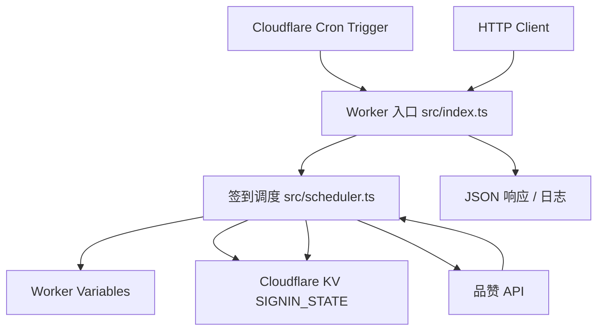

# ipzan-worker

品赞 HTTP 代理每周自动签到

> 原仓库地址：https://github.com/yunjietu/pinzan

[](https://workers.cloudflare.com/)
[](https://www.typescriptlang.org/)
[](https://developers.cloudflare.com/workers/wrangler/)
[](LICENSE)

## 一键部署

本项目提供一键部署到 Cloudflare Workers 的最小示例模板，无需服务器即可定时运行：

[](https://deploy.workers.cloudflare.com/?url=https://github.com/hungryM0/ipzan)

账号和密码按行一一对应

## 功能

- 无服务器的定时自动签到
- 签到成功后只更新当前账号计时器（签到失败不重置计时器）
- 支持手动触发签到

## 技术架构



## 配置

`wrangler.jsonc` 里的 `vars` 会出现在一键部署页面。部署后也能在 Cloudflare 控制台修改。

```jsonc
{
  "vars": {
    "PZHTTP_ACCOUNTS": "18888888888\n19999999999",
    "PZHTTP_PASSWORDS": "password\npassword",
    "MANUAL_RUN_TOKEN": "change-me",
    "RUN_INTERVAL_HOURS": "170"
  }
}
```

可用变量：

| 变量 | 默认值 | 说明 |
| --- | --- | --- |
| `PZHTTP_ACCOUNTS` | 示例手机号 | 账号列表，一行一个 |
| `PZHTTP_PASSWORDS` | 示例密码 | 密码列表，一行一个 |
| `MANUAL_RUN_TOKEN` | `change-me` | 手动触发接口的 Bearer Token |
| `RUN_INTERVAL_HOURS` | `170` | 同一账号两次成功签到之间的最小间隔（小时） |

## API

| 路由 | 方法 | 鉴权 | 说明 |
| --- | --- | --- | --- |
| `/health` | `GET` | 无 | 返回服务状态、账号数量、签到间隔 |
| `/run` | `POST` | `Authorization: Bearer <MANUAL_RUN_TOKEN>` | 手动触发到期账号签到 |
| `/run?force=1` | `POST` | `Authorization: Bearer <MANUAL_RUN_TOKEN>` | 忽略间隔，强制尝试所有账号 |
| `/run?account=18888888888&force=1` | `POST` | `Authorization: Bearer <MANUAL_RUN_TOKEN>` | 忽略间隔，只重试指定账号 |

# License

[MIT License](LICENSE)